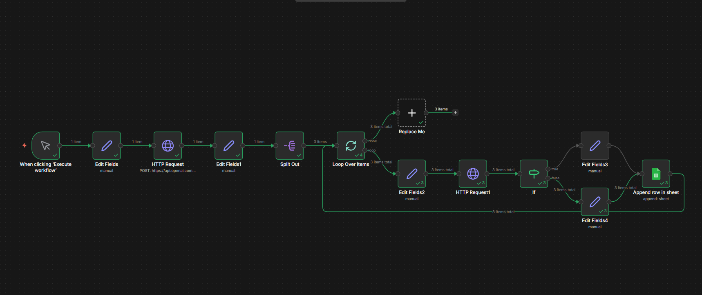
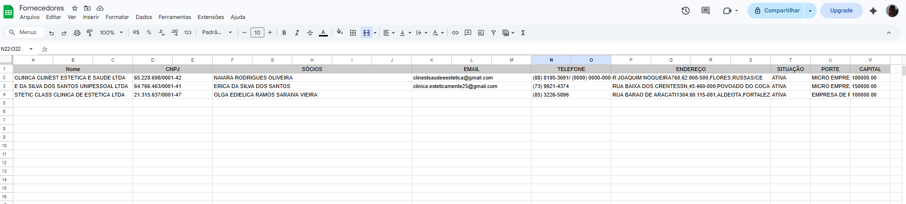

# n8n-leads-automation

Automação desenvolvida com n8n para buscar dados de empresas brasileiras a partir de CNPJs e organizar automaticamente as informações em uma planilha do Google Sheets.

O workflow realiza a coleta e o enriquecimento de dados empresariais, permitindo estruturar informações relevantes para análise e geração de leads.

## Funcionalidades

- Busca automatizada de empresas
- Consulta de dados empresariais via CNPJ
- Coleta de informações como nome da empresa, sócios e capital social
- Tratamento e organização dos dados
- Armazenamento automático das informações em uma planilha

## Tecnologias utilizadas

- n8n
- Integração com APIs
- HTTP Request
- Google Sheets

## Workflow

O fluxo de automação funciona da seguinte forma:

1. Um gatilho inicia o processo de automação.
2. O sistema realiza requisições HTTP para buscar dados de empresas através de CNPJs.
3. As informações retornadas pela API são tratadas e organizadas.
4. Os dados relevantes são estruturados em campos específicos.
5. As informações são armazenadas automaticamente em uma planilha do Google Sheets.

## Resultado na planilha

Após o processamento, os dados coletados são organizados automaticamente na planilha, contendo informações como empresa, CNPJ, sócios e capital social.

